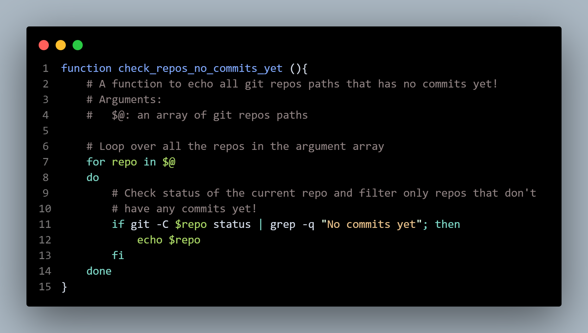

# Git Management Automation

## Project Overview

This project scans all git repos in my local directory; then outputs a summary
of all my projects, and lists repos that needs to be committed, pushed, or pulled.

I developed this project in Bash; mainly to train my new skills in Shell & Bash,
after studying 3 courses in Datacamp related to Shell, Git, and Bash scripting:

## Project Structure
I have 3 main directories in the same path:
* `git-management-automation`: Which contains this project
* `Public`: Which contains all Git repos that I am hosting publicly on Github.
* `Private`: Which contains all Git repos that I hosting privately on Github.

> Note that `public` and `private` repos are separated as I often duplicate a private repo then host it as a public repo after removing all sensitive data.

## Main Features
* Scans all repos directories in both the `Public` and `Private` directories.

* Run `git status` in each repo.

* Generates a full summary report including:

    * Count of public repos.
    * Count of private repos.
    * Total count of all existing repos.
    * Count of repos that have changes need to be committed.
    * Count of repos that have commits needs to be pushed.
    * Count of repos that have pull requests need to be made.
    * Count of clean repos that need no actions.  
      
* Lists the absolute paths of repos only in the following cases:
    * Have changes need to be committed.
    * Have commits need to be pushed.
    * Have pull requests need to be made.

## What Software Did I Need?

* Bash Scripting:  
    * Bash variables
    * Numeric variables in Bash
    * Arrays in Bash
    * If statements
    * FOR loops
    * Functions in Bash
* A text editor: VS Code
* Version Control with Git

## Screenshots

## About The Author

* Author: Mohamed Abdel-Gawad Ibrahim
* Contact: muhammadabdelgawwad@gmail.com
* Phone: +201069052620 | +201147821232
